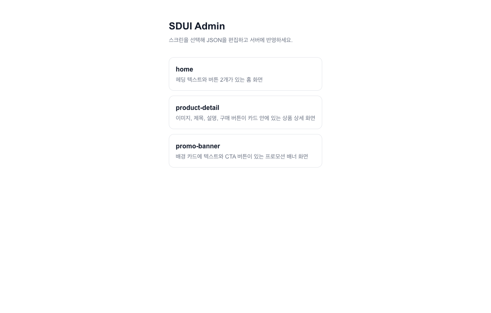
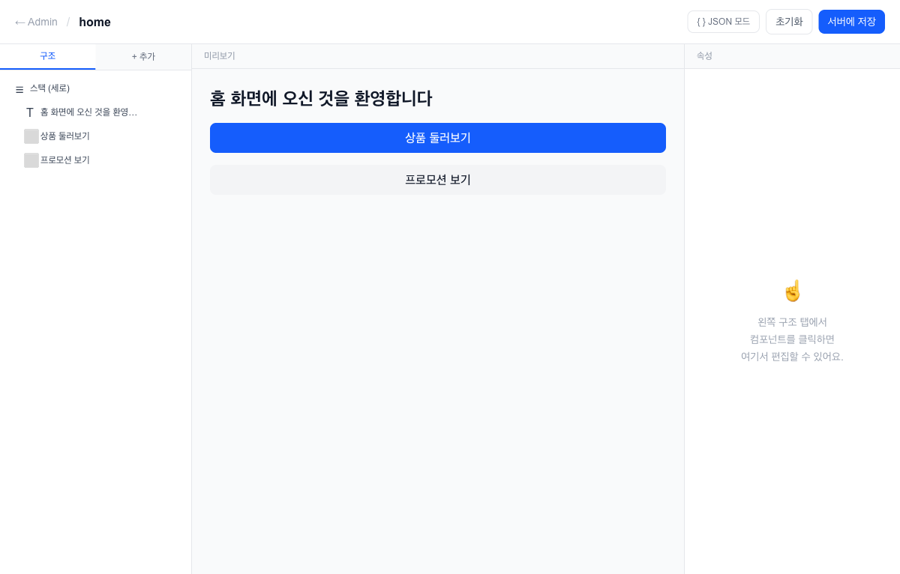

# SDUI — Server-Driven UI

서버가 컴포넌트 트리를 JSON으로 내려주면 클라이언트가 렌더링하는 구조를 탐구한 실험 프로젝트.

**라이브 데모:** http://13.125.232.51/admin

---

## 핵심 아이디어

앱 업데이트 없이 서버에서 UI를 제어한다.

```
GET /screens/home
→ {
    "screenId": "home",
    "root": {
      "type": "stack",
      "props": {
        "children": [
          { "type": "text", "props": { "content": "홈 화면", "style": "heading" } },
          { "type": "button", "props": { "label": "상품 보기", "action": { "type": "navigate", "url": "/products" } } }
        ]
      }
    }
  }
```

클라이언트는 이 JSON을 받아 React 컴포넌트로 렌더링한다. 서버에서 JSON을 바꾸면 클라이언트 배포 없이 UI가 바뀐다.

---

## 아키텍처

```
┌─────────────────────────────────────────────┐
│                  Turborepo                  │
│                                             │
│  ┌──────────────┐      ┌──────────────────┐ │
│  │  apps/web    │      │   apps/api       │ │
│  │  Next.js 16  │◄────►│   NestJS 11      │ │
│  │  :3000       │      │   :3001          │ │
│  └──────────────┘      └──────────────────┘ │
│          │                      │           │
│          └──────────┬───────────┘           │
│                     │                       │
│           packages/sdui-schema              │
│           (공유 타입 — 빌드 없이 TS 직접 참조) │
└─────────────────────────────────────────────┘
```

### 컴포넌트 타입

| 타입 | 설명 |
|---|---|
| `text` | 텍스트 (heading / body / caption) |
| `image` | 이미지 (src, alt, width, height) |
| `button` | 버튼 (navigate / deeplink / api_call 액션) |
| `stack` | row/column 레이아웃 컨테이너 |
| `card` | 카드 컨테이너 |
| `list` | 리스트 컨테이너 |

### 데이터 흐름

```
NestJS (ScreensService, 인메모리)
  → SDUIScreen JSON
    → Next.js SDUIRenderer
      → React 컴포넌트 트리
```

---

## Admin UI

비주얼 에디터로 스크린을 실시간 편집하고 서버에 저장할 수 있다.

**스크린 목록**


**비주얼 에디터**


- **구조 탭** — 컴포넌트 트리 탐색 및 순서 변경
- **+ 추가 탭** — 팔레트에서 컴포넌트 드래그 없이 추가
- **속성 패널** — 선택한 컴포넌트의 props 편집
- **미리보기** — 편집 결과 실시간 확인
- **JSON 모드** — 원시 JSON 직접 편집

---

## 배포 구조 (CI/CD)

```
Push to main
    │
    ▼
GitHub Actions — CI (lint + type-check + test)
    │ 성공 시
    ▼
GitHub Actions — Deploy
    ├─ [1] Build & Package  (Turborepo 빌드 → tar.gz)
    ├─ [2] Upload to S3     (버전별 아티팩트 보관)
    ├─ [3] Deploy to EC2    (SSH → S3 다운로드 → PM2 재시작)
    │       └─ Health Check  (EC2 내부 localhost:3001 확인)
    └─ [4] Rollback         (배포 실패 시 이전 버전 자동 복원)
```

**인프라**
- EC2 (t2.micro, ap-northeast-2) + nginx 리버스 프록시
- S3: 버전별 아티팩트 보관 (`releases/{sha}/`) + `latest/` 포인터
- PM2: 프로세스 관리 및 자동 재시작

---

## 로컬 실행

```bash
# 의존성 설치
npm install

# web + api 동시 실행 (Turborepo)
npm run dev
# → web: http://localhost:3000
# → api: http://localhost:3001
```

**환경 변수**

| 변수 | 기본값 | 설명 |
|---|---|---|
| `NEXT_PUBLIC_API_URL` | `http://localhost:3001` | API 서버 주소 |

---

## 기술 스택

| 영역 | 기술 |
|---|---|
| 프론트엔드 | Next.js 16, TypeScript, Tailwind CSS v4 |
| 백엔드 | NestJS 11, TypeScript |
| 모노레포 | Turborepo |
| 공유 타입 | `@sdui/schema` (빌드 없는 TS 직접 참조) |
| CI/CD | GitHub Actions |
| 인프라 | AWS EC2, S3, nginx, PM2 |
